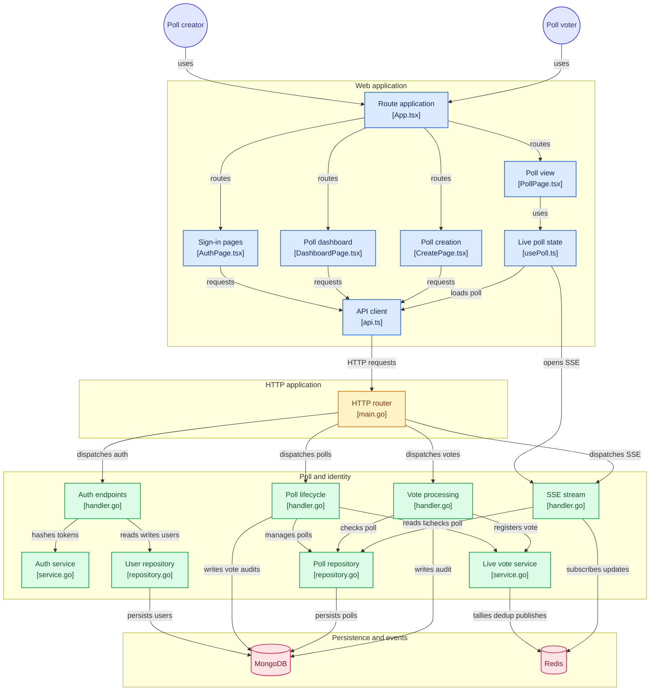

# Signal Poll — Real-Time Polling Engine

> A high-performance, real-time polling application engineered with Go, Gin, Redis, MongoDB Atlas, React, TypeScript, and Caddy with automatic TLS.

[](https://github.com/naveencreation/realtime-polling-app)
[](https://opensource.org/licenses/MIT)
[](https://polling.naveenselvan.me)

---

## 🌐 Live Deployments

| Component | URL | Provider | Details |
| :--- | :--- | :--- | :--- |
| **Frontend Web App** | [https://polling.naveenselvan.me](https://polling.naveenselvan.me) | Vercel Edge CDN | React 19 + TypeScript + Vite |
| **Backend REST & SSE API** | [https://polling-api.naveenselvan.me](https://polling-api.naveenselvan.me) | AWS EC2 + Caddy | Go 1.24 + Gin + Redis + MongoDB |
| **API Healthcheck** | [https://polling-api.naveenselvan.me/healthz](https://polling-api.naveenselvan.me/healthz) | AWS EC2 | Liveness probe (HTTP 200) |
| **API Readiness Probe** | [https://polling-api.naveenselvan.me/readyz](https://polling-api.naveenselvan.me/readyz) | AWS EC2 | Validates Redis & Mongo connectivity |

---

## 🏛️ System Architecture



---

## ⚡ Architectural Decisions & Technical Trade-offs

### 1. In-Memory Redis vs. Relational/Document DB for Voting
* **The Problem**: High-volume voting generates extreme write contention. Updating counters in a relational or document database creates locking bottlenecks, disk I/O latency, and deadlocks.
* **The Solution**: 
  - **Redis Atomic Operations**: Every vote uses Redis `HINCRBY poll:{id}:counts {optionId} 1` executed in single-digit microseconds without database locks.
  - **Deduplication**: Voter identity tokens are tracked using Redis Sets (`SADD poll:{id}:voters {voterToken}`). `SADD` returns `1` if added (vote accepted) or `0` if already present (duplicate rejected), providing $O(1)$ constant-time vote deduplication.
  - **Real-Time Pub/Sub**: Immediately upon incrementing counts, the server publishes updated tally snapshots to the Redis channel `poll:{id}:events`.

### 2. Server-Sent Events (SSE) vs. WebSockets
* **The Decision**: Chosen **SSE (`text/event-stream`)** over WebSockets for live poll metrics.
* **Rationale**:
  - **Unidirectional Efficiency**: Poll result viewing is strictly unidirectional (server pushes updated vote tallies to clients). Votes themselves are standard HTTP POST requests.
  - **Native Browser Resiliency**: Browsers natively reconnect SSE with exponential backoff and send `Last-Event-ID` on disconnect.
  - **Firewall & Proxy Compatibility**: SSE operates over standard HTTP/1.1 and HTTP/2 connections through standard reverse proxies and corporate firewalls without requiring WebSocket upgrade headers.

### 3. Asynchronous Durability & Audit Trail
* **Hybrid Storage Pattern**:
  - While counts and voter uniqueness are governed in real time by Redis, an audit record is asynchronously dispatched to MongoDB's `votes` collection:
    ```json
    {
      "pollId": "ObjectId(...)",
      "optionId": "opt-1",
      "voterToken": "uuid...",
      "votedAt": "2026-09-25T16:00:00Z"
    }
    ```
  - This guarantees write auditing, analytics capability, and recovery paths without penalizing vote response latency.

### 4. Hybrid Cross-Origin Authentication
* **Cookie + Bearer Token Dual Support**:
  - Modern web browsers enforce strict third-party cookie restrictions (Safari ITP, Brave, Chrome Privacy Sandbox).
  - Signal Poll implements a **dual-authentication mechanism**:
    1. **`HttpOnly; SameSite=None; Secure` Cookies**: Automatically set and validated for same-site and trusted cross-origin contexts.
    2. **Bearer Authorization Header**: The client transparently caches JWTs in `localStorage` and transmits `Authorization: Bearer <token>` on all privileged requests.
    3. **`X-Voter-Token` Header**: Ensures unauthenticated voters can reliably cast votes and stay deduplicated across browsers and incognito windows.

---

## 🚀 Key Features

* 🗳️ **Instant Poll Creation**: Multiple options, custom expiration timers, and shareable rooms.
* 📊 **Sub-Second Real-Time Updates**: Watch live votes increment instantly via SSE without refreshing.
* 🛡️ **Zero-Pollution Vote Deduplication**: Cookie + local voter fingerprinting prevents double-voting.
* 🔒 **Secure Creator Authentication**: BCrypt hashed passwords, signed JWT tokens, and protected creator dashboards.
* 🎨 **Editorial Swiss Design**: Built with a sleek dark aesthetic, responsive bento grids, accessible semantic markup, and zero layout shift.
* 🌐 **Full Production Deployment**: Production DNS with custom domain, automated SSL renewal, and zero-downtime container configuration.

---

## 🛠️ Tech Stack

* **Backend**: Go 1.24, Gin Framework, `github.com/redis/go-redis/v9`, `go.mongodb.org/mongo-driver/v2`, `golang-jwt/jwt/v5`, `golang.org/x/crypto/bcrypt`.
* **Frontend**: React 19, TypeScript, Vite, React Router 7, Lucide Icons, Canvas Confetti.
* **Databases**: Redis 7 Alpine (In-memory tallying & PubSub), MongoDB Atlas (Document persistence).
* **Reverse Proxy**: Caddy Web Server 2 (Automated Let's Encrypt TLS, HTTP/2).
* **Cloud Infrastructure**: AWS EC2 (AP South 1 Mumbai), Vercel Global Edge Network.

---

## 📦 Local Development Setup

### Prerequisites
* Docker & Docker Compose
* Go 1.24+ (optional, for local development outside Docker)
* Node.js 20+ & npm

### 1. Clone Repository
```bash
git clone https://github.com/naveencreation/realtime-polling-app.git
cd realtime-polling-app
```

### 2. Environment Configuration
Copy sample configuration files:
```bash
cp backend/.env.example backend/.env
cp frontend/.env.example frontend/.env
```

### 3. Launch with Docker Compose
```bash
docker compose up -d
```
The services will be available at:
* Frontend: `http://localhost:5173`
* Backend API: `http://localhost:8080`
* Redis: `localhost:6379`

---

## 📡 REST API Reference

### Public & Health Endpoints
* `GET /healthz` — Service health probe. Returns `200 OK`.
* `GET /readyz` — Database readiness probe. Validates Redis & Mongo connections.

### Authentication Endpoints
* `POST /api/auth/signup` — Create a new creator account.
  ```json
  { "username": "creator", "email": "creator@example.com", "password": "securepassword123" }
  ```
* `POST /api/auth/login` — Login and receive session cookie + JWT bearer token.
  ```json
  { "email": "creator@example.com", "password": "securepassword123" }
  ```
* `POST /api/auth/logout` — Revoke session cookie.

### Polls Endpoints
* `POST /api/polls` *(Auth Required)* — Create a new poll.
  ```json
  {
    "question": "What is your primary programming language for distributed systems?",
    "options": ["Go", "Rust", "TypeScript", "Python"],
    "expiresAt": "2026-10-01T00:00:00Z"
  }
  ```
* `GET /api/polls/mine` *(Auth Required)* — List polls created by the authenticated creator.
* `GET /api/polls/:id` — Get poll details, options, expiration status, and current counts.
* `PATCH /api/polls/:id/close` *(Auth Required)* — Immediately close voting on a poll.
* `DELETE /api/polls/:id` *(Auth Required)* — Permanently delete a poll, cascade purge audit records from MongoDB, remove in-memory Redis keys, and broadcast a deletion event to SSE listeners. **Constraint**: The poll must be in `closed` status before it can be deleted (Rule B lifecycle safeguard).

### Voting & Real-Time Streams
* `POST /api/polls/:id/vote` — Cast an atomic vote.
  ```json
  { "optionId": "0" }
  ```
* `GET /api/polls/:id/stream` — Connect to live SSE stream for real-time count broadcasts.

---

## 📄 License
This project is open-source under the [MIT License](LICENSE).
